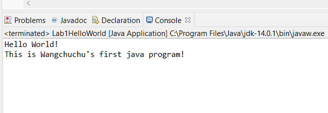

# Lab 1 - Hello World

1. Download JDK https://www.oracle.com/java/technologies/javase-jdk14-downloads.html (Links to an external site.)

2. Install JDK (all default options)

3. Verify you have the right java version (open the Command Prompt)

4. Download and Install Eclipse/IntelliJ IDEA https://www.eclipse.org/downloads/packages/release/2020-06/r/eclipse-ide-java-developers (Links to an external site.)

5. Write and run a java project - "Hello World!"

6. There should be two sentences on the console (change a new line when you write the second sentence using your name):

7. The method to submit your assignment. 

    a) Submit a .java file.

    b) Submit a file with your code on it (e.g. a word file, a pdf file).

 