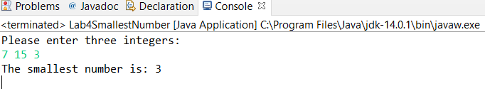

# Lab 4 - Smallest Number

Coding Exercise: Smallest Number

Prompt the user to enter three integers from the keyboard. Write a program whose inputs are the three integers, and whose output is the smallest of the three values.

Example:

If the input is: 7 15 3

the output is: 3

