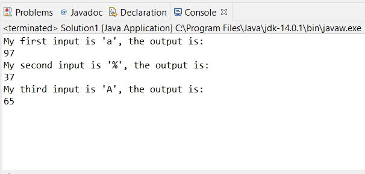

# Lab 5 - Method

Create and Invoke a method

1. Create a method to convert a char to an integer. You can assume the char is in ASCII code (Click to See the DefinitionLinks to an external site.), so the value of the char should be in 0~255.

2. Call this method you created in the main method using the following examples:

Example 1:

Input: 'a'

Output: 97

Explanation:      return the number of the char in ASCII.

Example 2:

Input: '%'

Output: 37

Explanation:      return the number of the char in ASCII.

3. Please provide a third input, and calculate the output.

4. The final result should be something look like this:

Lab Exercise 5 (Method)
Lab Exercise 5 (Method)
Due: Fri Feb 25, 2022 11:59pmDue: Fri Feb 25, 2022 11:59pm
Ungraded, 10 Possible Points
10 Possible Points
Attempt
Attempt 1

IN PROGRESS
Next Up: Submit Assignment

0
Unlimited Attempts Allowed
Available: Feb 25, 2022 11:00amAvailable: Feb 25, 2022 11:00amuntil May 7, 2022 11:59pm until May 7, 2022 11:59pm
Create and Invoke a method

1. Create a method to convert a char to an integer. You can assume the char is in ASCII code (Click to See the DefinitionLinks to an external site.), so the value of the char should be in 0~255.

2. Call this method you created in the main method using the following examples:

Example 1:

Input: 'a'

Output: 97

Explanation:      return the number of the char in ASCII.

Example 2:

Input: '%'

Output: 37

Explanation:      return the number of the char in ASCII.

3. Please provide a third input, and calculate the output.

4. The final result should be something look like this:

Lab1

5. The method to submit your assignment.

Submit a .java file.