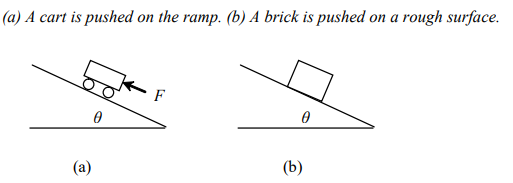

# Lab 6 - Ramp Angle

Physics: ramp angle

Suppose you push a cart on a ramp, as shown below. Ignoring friction, the cart mass (m) in kilograms, the force to push the cart (F) in Newtons, and the ramp angle can be defined using the following formula:

F = m × g ×sinθ

Where g is the acceleration due to gravity, which is a constant 9.8 (meters per square second). Write a program that prompts the user to enter F and m and determine the angle in degree. Here is a sample run of the program:

<output>

Enter the mass of the cart: 30

Enter the force to push the cart: 20

The angle of the ramp is 3.9 degrees

<end output>

The method to submit your assignment.

Submit a .java file.